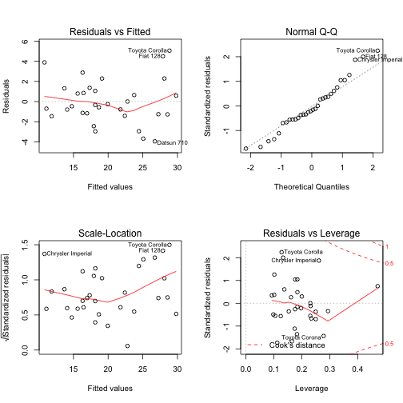

## Executive Summary

This application help to realize the cars' relationship between miles per galon (MPG) and other variables in dataset. For this we have the folowing database:


    Motor Trend Car Road Tests: The data was extracted from the 1974 Motor Trend US magazine, 
    and comprises fuel consumption and 10 aspects of automobile design and performance for  
    32 automobiles (1973-74 models). This aplication show scaterplot graphics and tendence  
    line resulting of applying linear regression to a mtcars dataset.


In this application version we only show linear regression with one regresors and used to identify the possible form of data in comparison to regression line.

The next release will show the procedure to select variable in a multivariable linear regression.

In this release you have to select a regressor for MPG variable and the application will show to you:
- Scatterplot in case of variable it continuous.
- Boxplot in case of variable it discrete.

--- .class #id 

## Data Description Table


The field in the data have the following meaning:

  Variable | Description 
  :-------:|:---------------
  mpg      |Miles/(US) gallon        
  cyl      |Number of cylinders      
  disp     |Displacement (cu.in.)   
  hp       |Gross horsepower         
  drat     |Rear axle ratio          
  wt       |Weight (lb/1000)         
  qsec     |1/4 mile time            
  vs       |V/S             
  am       |Transmission (0 = automatic, 1 = manual)
  gear     |Number of forward gears
  carb     |Number of carburetors

--- .class #id 

## Proposed Model

When the application will finish, we will show how to reach the following linear model:

    mpg ~ factor(am) + factor(cyl) + wt + hp

The next table shown their coefficients:


```
##              Estimate Std. Error t value  Pr(>|t|)
## (Intercept)  33.70832    2.60489 12.9404 7.733e-13
## factor(am)1   1.80921    1.39630  1.2957 2.065e-01
## factor(cyl)6 -3.03134    1.40728 -2.1540 4.068e-02
## factor(cyl)8 -2.16368    2.28425 -0.9472 3.523e-01
## wt           -2.49683    0.88559 -2.8194 9.081e-03
## hp           -0.03211    0.01369 -2.3450 2.693e-02
```

--- .class #id 

## Residual Plot

The following graphics, called, "Residual Plots" are used to evaluate the "quality of model", will be reviewed in the next release:

 
